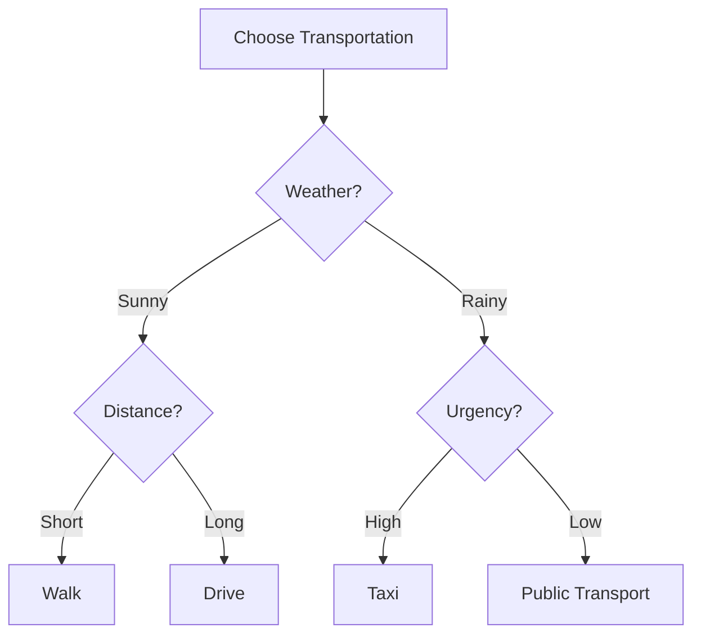
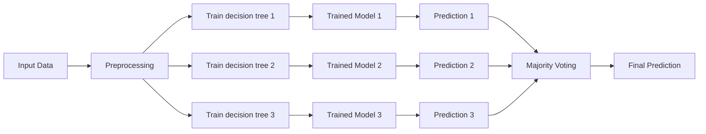
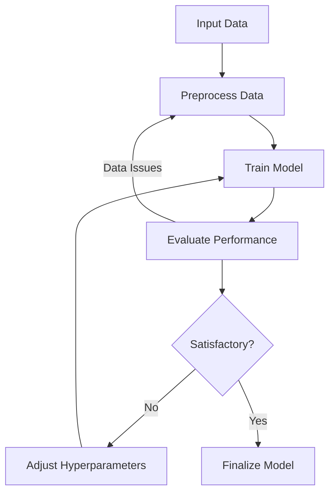
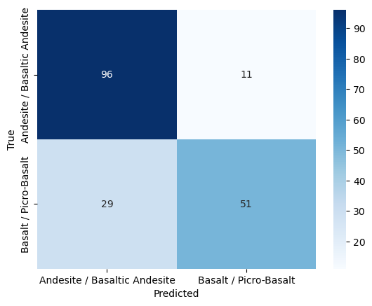
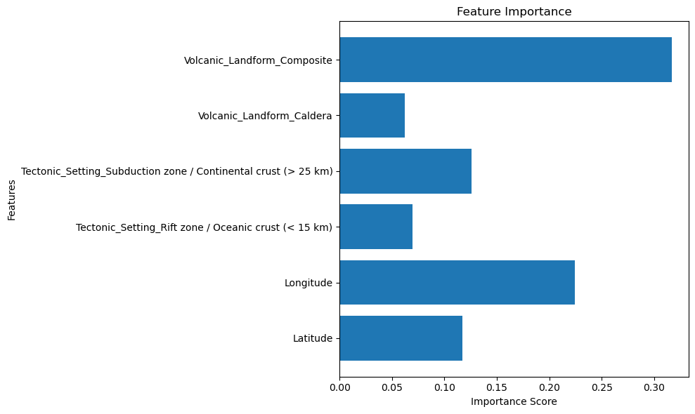
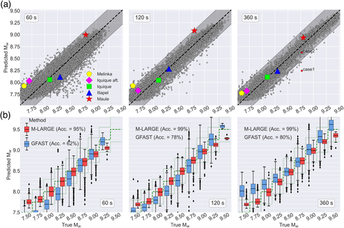

---
# You can also start simply with 'default'
theme: default
# random image from a curated Unsplash collection by Anthony
# like them? see https://unsplash.com/collections/94734566/slidev
background: https://png.pngtree.com/background/20211215/original/pngtree-binary-matrix-code-flow-dark-abstract-background-picture-image_1466835.jpg
# some information about your slides (markdown enabled)
title: Intro to Machine Learning Tools & Applications for Geoscience
# info: |
#   ## Slidev Starter Template
#   Presentation slides for developers.

#   Learn more at [Sli.dev](https://sli.dev)
# apply unocss classes to the current slide
layout: cover
class: text-left
# https://sli.dev/features/drawing
drawings:
  persist: false
# slide transition: https://sli.dev/guide/animations.html#slide-transitions
transition: slide-left
# enable MDC Syntax: https://sli.dev/features/mdc
mdc: true
hideInToc: true
---

# Intro to Machine Learning Tools & Applications for Geoscience

Nathalie Redick

<!-- <div @click="$slidev.nav.next" class="mt-12 py-1" hover:bg="white op-10">
  Press Space for next page <carbon:arrow-right />
</div>

<div class="abs-br m-6 text-xl">
  <button @click="$slidev.nav.openInEditor" title="Open in Editor" class="slidev-icon-btn">
    <carbon:edit />
  </button>
  <a href="https://github.com/slidevjs/slidev" target="_blank" class="slidev-icon-btn">
    <carbon:logo-github />
  </a>
</div> -->

<!--
The last comment block of each slide will be treated as slide notes. It will be visible and editable in Presenter Mode along with the slide. [Read more in the docs](https://sli.dev/guide/syntax.html#notes)
-->

<!-- ## Objectives

- Build a basic understanding of ML
- Gain some familiarity with ML vocabulary
- Learn about some of the tools available for ML in geoscience applications/research -->

---
# image: https://cover.sli.dev
layout: section
hideInToc: true
---

# What is Machine Learning?

It's ~fancy~ stats, not magic

---
layout: center
transition: slide-up
---


<!-- AI: Think of those "AI" players when you play chess or other games online -->

<!--
1. **Artificial Intelligence (AI)**: AI refers to the simulation of human-like intelligence in machines to perform tasks such as decision-making or problem-solving, e.g., AI-players in online chess.

2. **Machine Learning (ML)**: ML is a subset of AI that enables machines to learn patterns from data and improve over time, e.g., email spam filters that adapt to detect new spam messages.

3. **Deep Learning (DL)**: DL is a specialized subset of ML using neural networks with many layers to analyze complex data, e.g., seismic p-wave arrival pickers, like EQ Transformer.
-->

---
layout: image-left
hideInToc: true
image: https://gadictos.com/wp-content/uploads/2019/05/1_1mpE6fsq5LNxH31xeTWi5w-scaled.jpeg
transition: slide-up
---

# Overview

<Toc minDepth="1" maxDepth="1" />

---
layout: center
---
# Goals

- Build a <span v-mark.circle.blue>basic</span> understanding of ML
- Gain some familiarity with ML vocabulary
- Learn about some of the tools available for ML in geoscience applications/research

---
layout: center
---

# What can ML do?
<br>

- Process huge amounts of large, multidimensional data
- Speed up data analysis & pattern recognition
- Automate repetitive workflows
- Explore complex relationships between parameters

## What can't ML do?
<br>

- Replace the need for domain expertise
- Provide absolute certainty on its predictions (probabilistic)
- Fully comprehend the context & implications of findings
- Be creative

---

# Some basics
<!-- Learning paradigms & algorithms -->

<br>

<div style="display: flex;">
  <div style="flex: 1; padding-right: 10px;">
    <h3>Learning paradigms</h3>
    <br>
    <ul>
      <li><span v-mark.circle.blue>supervised</span></li>
      <li>unsupervised</li>
      <li>reinforcement learning</li>
    </ul>
  </div>
  <div style="flex: 1; padding-left: 10px;">
    <h3>Algorithms</h3>
    <br>
    <ul>
      <li>regression</li>
      <li>dimensionality reduction</li>
      <li>clustering</li>
      <li><span v-mark.circle.blue>classification</span></li>
    </ul>
  </div>
</div>

<!--
1. **Supervised Learning**: The algorithm learns from labeled data, using known outputs to minimize prediction errors.

2. **Unsupervised Learning**: This paradigm discovers patterns in unlabeled data without predefined outputs or guidance.

3. **Reinforcement Learning**: An agent learns through trial and error in an environment, aiming to maximize cumulative rewards over time.

4. **Clustering**: Algorithms group similar data points together based on their features, without prior labels, to identify inherent structures within the data.

5. **Regression**: This approach predicts continuous output values from input features by modeling the relationship between them, often minimizing the error between predicted and actual values.

6. **Classification**: Algorithms assign discrete labels to input data based on learned patterns from labeled training data, aiming to categorize new instances into predefined classes.

7. **Reinforcement Learning**: An agent learns to make decisions by interacting with an environment, optimizing its actions based on received rewards or penalties over time.
-->

---
layout: intro
---

# Demo: building a model from start to finish

<br>

1. <span v-mark.underline.blue>Data Preprocessing</span>
2. Model Selection
3. Model Training
4. Model Evaluation
5. ~~Model Deployment~~

<br>

## Our goal

Use volcano data from the Smithsonian database to **predict** the major rock type of a volcano based on other **features** like volcano type and tectonic setting.


<!-- If you've ever been to a talk on ML, you've probably heard the term <span v-mark.underline.blue>"black box"</span> used to describe the inner workings of a model.

This refers to models that are so complex that it's difficult to understand how they make decisions. -->

---
layout: cover
---

## Disclaimer: this is *not* a cutting edge model!

<!--
- it is built to be a simple, easy-to-follow example to give you a taste of what building a model is like
- I only spent about two hours on it last night
- designed to introduce a lot of the common vocabulary and concepts in ML
-->

---
level: 2
layout: image-right
image: https://volcano.si.edu/gallery/photos/GVP-02480.jpg
---

## Data Preprocessing
<!-- How to prepare your dataset for the model -->
<br>

- Data cleaning
- Data transformation
- Feature selection
- Data normalization/standardization & encoding
- Train/test split

<!--
we need to prep our data so it's ready to be input into the model.

I'm going to step through the data preprocessing workflow, which varies a lot from dataset to dataset.

This part of the ML pipeline requires a solid understanding of the domain you are working in, especially as your questions become more complex.
-->

---

### First things first: We need some data to play with 🌋

Download Holocene and Pleistocene volcano data from the Smithsonian database using `geopandas`
```python
# request data from Smithsonian database
server = 'https://webservices.volcano.si.edu/geoserver/GVP-VOTW/ows?'
queries = {
    'holocene':
        'service=WFS&request=GetFeature&typeName=GVP-VOTW:Smithsonian_VOTW_Holocene_Volcanoes&outputFormat=json',
    'pleistocene':
        'service=WFS&request=GetFeature&typeName=GVP-VOTW:Smithsonian_VOTW_Pleistocene_Volcanoes&outputFormat=json'
}

# download data using geopandas
holocene_volcanoes = gpd.read_file(server + queries['holocene'])
pleistocene_volcanoes = gpd.read_file(server + queries['pleistocene'])

# combine dataframes
volcanoes = gpd.GeoDataFrame(pd.concat([holocene_volcanoes, pleistocene_volcanoes], ignore_index=True))
```

<!--
note: I don't expect people to read & understand every line of code in this presentation. the code is here as a guide to show how much code goes into building a ML model.

Those who took Magali's PyGMT class last semester might recognize this: I am querying the Smithsonian's volcano database for their datasets of holocene and pleistocene volcanoes, then combining them.
-->

---

#### What does the data look like?

| **Major_Rock_Type** | **Tectonic_Setting** | **Primary_Volcano_Type** | **Latitude** | **Longitude** | **Volcanic_Landform** |
|----------------|-----------------|----------------------|----------|-----------|------------------|
| Basalt / Picro-Basalt | Rift zone / Continental crust (> 25 km) | Lava dome(s) | 45.7860 | 2.9810 | Cluster |
| Basalt / Picro-Basalt | Intraplate / Continental crust (> 25 km) | Volcanic field | 38.8700 | -4.0200 | Cluster |
| Andesite / Basaltic Andesite | Subduction zone / Continental crust (> 25 km) | Stratovolcano | 38.6380 | 15.0640 | Composite |
...
<p>933 rows × 6 columns</p>

<!--
So, what does the data we're looking with actually look like?

We have several different parameters or features, which are the column names in the top row.

The first column here is the parameter we are going to predict, which we call Y.

The remaining columns are the features the model is going to "learn" to use to make predictions.

We have two primary types of data: text and numbers.
-->

---

### Data cleaning & transformation

```python
# remove rows with missing values
volcanoes.dropna(subset=['Latitude', 'Longitude', 'Primary_Volcano_Type', 'Tectonic_Setting', 'Major_Rock_Type'],
inplace=True)

# check out the range of values in the 'Major_Rock_Type' column
volcanoes['Major_Rock_Type'].value_counts()
```
Output:
```
Major_Rock_Type
Andesite / Basaltic Andesite                533
Basalt / Picro-Basalt                       400
Dacite                                       85
Trachybasalt / Tephrite Basanite             62
Rhyolite                                     53
No Data (checked)                            39
Trachyte / Trachydacite                      35
Trachyandesite / Basaltic Trachyandesite     24
Foidite                                      14
Phonolite                                     8
Phono-tephrite /  Tephri-phonolite            3
Name: count, dtype: int64
```

```python
# filter for two most common rock types
volcanoes = volcanoes[volcanoes['Major_Rock_Type'].isin(['Andesite / Basaltic Andesite', 'Basalt / Picro-Basalt'])]
```

<!--
In my experience, data cleaning & transformation is always the hardest & messiest part of the process.

Here, I have removed any rows that were missing data.

Then, I printed out the parameter (major rock types) value counts, to get an idea of the spread of the data (how balanced it is)

.... it's pretty unbalanced, so for the rest of this example, we're going to focus on training a model to learn the difference between the two major rock types represented here: andesite and basalt.
-->

---
layout: iframe
url: https://nredick.github.io/volcanoes.html
---

<!--
### Data visualization

Here, I have plotted the dataset once is has been filtered down to just basalt (in purple) and andesite (in red).

This is a good way to get an idea of how the data is spread across lat and lon, which are features the model will be learning.

you can see there's some clusters, but we have a decent spread of the data.
-->

---
transition: slide-up
---

### Feature selection, standardization, & encoding

What **features** (`X`) are we going to use to predict the major rock type (our target, `y`) of a volcano?

```python
# separate features (X) and target (y)
X = volcanoes[['Latitude', 'Longitude', 'Tectonic_Setting', 'Volcanic_Landform', 'Primary_Volcano_Type']]
y = volcanoes['Major_Rock_Type']
```
<br>

### Data transformation
```python
# define a preprocessor to normalize numerical features and encode categorical features
preprocessor = ColumnTransformer(
    transformers=[
        ('num', StandardScaler(), ['Latitude', 'Longitude']), # standardize
        ('cat', OneHotEncoder(handle_unknown='ignore'), # one-hot encoding
         ['Tectonic_Setting', 'Volcanic_Landform', 'Primary_Volcano_Type'])
    ])

label_encoder = LabelEncoder()
y_encoded = label_encoder.fit_transform(y)

```

<!--
now it's time to convert the data into a format that the computer can recognize.

first, we separate the dataset to isolate our target parameter from the features.

then, we define a preprocessor that will transform the data in the columns.

here, I am doing two types of transformation: encoding and standardization. I am standardizing the lat and lon values (so, for example, the model doesnt think data points near the equator are less important because the values are smaller)

Then, i am *encoding* the text values, which means assigning them numbers to represent the text values.
-->

---
transition: slide-right
---

What does "encoded" data really look like?

`y_encoded`: our **label-encoded** target tensor
```
array([1, 1, 0, 0, 1, 1, 0, 0, 0, 0, 0, 0, 0, 0, 1, 1, 1, 1, 1, 1, 1, 1,
       1, 1, 1, 1, 1, 1, 1, 1, 1, 1, 1, 1, 1, 1, 1, 1, 1, 1, 1, 1, 1, 1,
       1, 1, 1, 1, 1, 1, 1, 1, 1, 1, 1, 1, 1, 1, 1, 1, 1, 1, 1, 1, 1, 1,
       1, 1, 1, 1, 1, 1, 1, 1, 1, 1, 1, 1, 1, 1, 1, 1, 1, 1, 1, 1, 1, 0,
       0, 0, 1, 1, 0, 0, 0, 0, 0, 1, 0, 1, 1, 0, 1, 1, 0, 0, 0, 0, 0, 0,
...
```

`X_train`: our **feature** tensor
```
<Compressed Sparse Row sparse matrix of dtype 'float64'
	with 3730 stored elements and shape (746, 42)>
  Coords	Values
  (0, 0)	-1.6456388799023938
  (0, 1)	1.3690578375972304
  (0, 11)	1.0
  (0, 15)	1.0
  (0, 37)	1.0
  (1, 0)	1.6163339408037167
...
```

<!--
so, what does the data look like after its transformed?

pretty unreadable, from a human perspective.

in the array of encoded targets, we have 1s and 0s. these represent our binary classification targets, basalt and andesite.

our feature tensor is even less readable. in fact, it's all but uninterpretable.

let's go back to processing the data.
-->

---

<style>
    b {
        color: teal;
    }
</style>

### Train/test split

1. <b>train</b>
2. <b>test</b>

<br>
```python
X_train, X_test, y_train, y_test = train_test_split(X, y_encoded, test_size=0.2, shuffle=True)
```

It's important to shuffle the data before splitting to avoid any <b>bias</b> in the data.

<!--
In order to *learn*, our model needs data to learn from AND some to evaluate its performance on (later). So, we split our data into two sets.

test_size is a fraction that represents how much of the original dataset we want to pull out and set aside for testing. in this case, 20%
-->

---
layout: intro
hideInToc: true
---

# Demo: building a model from start to finish

<br>

1. ~~Data Preprocessing~~
2. <span v-mark.underline.blue>Model Selection</span>
3. Model Training
4. Model Evaluation

<!--
so that's data preprocessing complete!

now, we'll move on to model selection.
-->

---
layout: iframe-right
url: https://scikit-learn.org/stable/modules/generated/sklearn.ensemble.GradientBoostingClassifier.html#gradientboostingclassifier
zoom: 0.8
transition: fade
---

<style scoped>
    b {
        color: teal;
    }
</style>

## Supervised classification...?

We want to <b>classify</b> the major rock type of a volcano based its other features. So, we're going to use a <b>supervised</b> learning algorithm because we have <b>labeled</b> data.

<!--
like we decided at the beginning, we are going to focus on doing a supervised classification model.

as a reminder, we use supervised models when we have data that is labelled & classification when we want to predict discrete values, in this case: basalt or andesite?

on the right is the documentation for the particular flavour of classifier we are going to use: the gradient boosting classifier, implemented in the sci kit learn python library

as you can see, it has a ton of different potential values we can adjust. these are called hyperparameters, which I will discuss more in a few slides.

you can see that it describes this classifier as stages of regression trees that are fit to the loss function. what the heck does that mean?
-->

---

<style scoped>
    b {
        color: teal;
    }
</style>

### `GradientBoostingClassifier`

<b>*Gradient*</b> $\implies$ using <b>gradient descent</b> to minimize the loss function by fitting a series of <b>decision trees</b> (weak learners) to the <b>residual losses</b> of the previous tree.


<b>*Boosting*</b> $\implies$ combining multiple weak learners (shallow trees) to create a strong learner; this is an <b>ensemble</b> method.

<b>*Classifier*</b> $\implies$ we're doing <b>classification</b> to predict <b>categorical</b> outputs.

<!--
let's look a bit closer at our algorithm. it has three main components: gradient, boosting, and classification.

Gradient descent optimizes functions by iteratively adjusting parameters toward the negative gradient to minimize loss. it does this by fitting several decision trees, which are "weak" learners, to the residual loss of the previous tree.

Residual loss just measures the difference between a model's predicted output and the actual observed data.

the gif helps visualize this process: the error surface represents the residual loss across the space of weights and biases of the function that the model is learning.

in gradient descent, it explores the surface, aiming to find the lowest point or the error surface, like a ball rolling down a slope.

Boosting means we take this process, and do it several times in tandem to create many of these decision trees.
-->

---
layout: two-cols
---

# What's a decision tree?



::right::

<br>
<br>

This tree has a `depth` of 2 (since we start counting from 0 at the root node).

<!--
i know, it's a lot of vocabulary. stay with me.

this is what our model is learning to create: a decision tree! you have almost certainly seen one before, if you have used flow charts to make a decision, like picking a movie to watch.

this tree helps us decide what type of transportation we should take based on the weather.

the root node is "weather", where the decision making process starts. the bottom, our decisions, are called leaf nodes.

because this is computer science, we count from zero (sorry, matlab fans) and that means the tree has a depth of 2.
-->

---
layout: fact
---

<style scoped>
    b {
        color: teal;
    }
</style>

### Ensemble methodology

<br>



Using several trained models <b>boosts</b> the overall performance of the model.

<!--
Now, to boost our model.

this graph shows the generalized architecture of our model.

each of the three paths in the middle operates as a completely separately trained model, making independent predictions on our volcano's major rock type.

then, we take the majority vote of models to get our final prediction.
-->

---
title: Model construction
hideInToc: true
---

Seems kinda complex... what does the code look like?

```python
# construct the model pipeline
model = Pipeline(steps=[
    ('preprocessor', preprocessor),
    ('classifier', GradientBoostingClassifier(
        verbose=1,
        n_estimators=100,
        validation_fraction=0.15,
        learning_rate=0.075,
        max_depth=3))
])
```

The pipeline has two steps:
1. Apply the preprocessor to the data before it is input to the classifier
   - <span text-sm>the one-hot encoding & standardization functions that were defined earlier</span>
2. Use the `GradientBoostingClassifier` to train the model

<br>
...that's it.

<!--
it might seem very complicated. how the hell do you code all that up?

thankfully, you don't have to.  sci-kit learn did it for you.

in fact, we can put together our data preprocessing and model construction on just a few lines.

this is our pipeline: the steps the computer will follow to train the model.

first, it applies our previously defined preprocessor to the input data. then, sets our model hyperparameters.

you can see i have set just a select few of the available parameters.
-->

---

### Model hyperparameters

(Some) values you can tweak to improve the performance of your model:

- `n_estimators`: the number of trees in the forest
- `learning_rate`: the rate at which the model learns from the data
- `max_depth`: the maximum depth of the tree
- `validation_fraction`: the fraction of the data to use for validation

<br>
```python
# construct the model pipeline
model = Pipeline(steps=[
    ('preprocessor', preprocessor),
    ('classifier', GradientBoostingClassifier(
        verbose=1,
        n_estimators=100,
        validation_fraction=0.15,
        learning_rate=0.075,
        max_depth=3))
])
```

(not the same as model parameters!)

<!--
note that hyperparams and params are different: params are the things the model is learning, hyperparams are constraints on how it is allowed to learn.
-->

---
layout: intro
hideInToc: true
---

# Demo: building a model from start to finish

<br>

1. ~~Data Preprocessing~~
2. ~~Model Selection~~
3. <span v-mark.underline.blue>Model Training</span>
4. Model Evaluation

<!--
now, to run the pipeline and train the model.
-->

---

## Model training
<br>

```python
model.fit(X_train, y_train)
```
Output:
```
      Iter       Train Loss   Remaining Time
         1           1.3102            0.21s
         2           1.2640            0.19s
         3           1.2242            0.27s
         4           1.1895            0.24s
         5           1.1590            0.21s
         6           1.1318            0.20s
         ...
        50           0.7840            0.06s
        60           0.7564            0.04s
        70           0.7349            0.03s
        80           0.7155            0.02s
        90           0.6875            0.01s
       100           0.6723            0.00s

Accuracy on Test Data: 82.89%
Log Loss on Test Data: 0.4393
```

<!--
it's just one line. yep. that's all.

here's what our verbose output looks like, it gives us information about the loss on the trees as they are trained.

how do we decide if this is good enough?
-->

---
layout: center
---

## An iterative process
<br>



<!--
in reality, we train a model many times over as we figure out what hyperparams lead to the best result.  

sometimes, if we see strange results, we can discover issues with our dataset, which means having to reprocess it.
-->

---
layout: intro
hideInToc: true
---

# Demo: building a model from start to finish

<br>

1. ~~Data Preprocessing~~
2. ~~Model Selection~~
3. ~~Model Training~~
4. <span v-mark.underline.blue>Model Evaluation</span>

---
layout: two-cols-header
---

## Model evaluation
*Confusion matrix*

::left::

```python
cm = confusion_matrix(y_test, y_pred)
```
<br>


::right::

<br>
<br>

<br>

<table style="border-collapse: collapse; width: 100%; text-align: center;">
  <tr>
    <th></th>
    <th>Predicted Positive</th>
    <th>Predicted Negative</th>
  </tr>
  <tr>
    <th>Actual Positive</th>
    <td style="background-color: #4CAF50; color: white;">True Positive (TP)</td>
    <td style="background-color: #F44336; color: white;">False Negative (FN)</td>
  </tr>
  <tr>
    <th>Actual Negative</th>
    <td style="background-color: #F44336; color: white;">False Positive (FP)</td>
    <td style="background-color: #4CAF50; color: white;">True Negative (TN)</td>
  </tr>
</table>

---
layout: iframe-right
url: https://scikit-learn.org/stable/api/sklearn.metrics.html#classification-metrics
---

<style scoped>
    b {
        color: teal;
    }
</style>

## Model evaluation
*Accuracy & loss*

We evaluate the model's performance on the test data, which it has never seen before.

```
Accuracy on Test Data: 82.89%
Log Loss on Test Data: 0.4393
```
<br>

$$ \text{Accuracy} = \frac{\text{Number of Correct Predictions}}{\text{Total Number of Predictions}} $$
​

For a single sample with true label and a probability estimate, the <b>log loss</b> is:
<!-- definition of log loss -->

$$ L_{\text{log}}(y, p) = - y \log(p_i) + (1 - y) \log(1 - p) $$

---

## Model evaluation
*Feature importance*



<!--
we can find out what features the model considered most important in its decision making process.
-->

---
layout: image-left
image: https://volcano.si.edu/gallery/photos/GVP-11680.jpg
---

## Interpretation

The model has learned how to predict the major rock type of a volcano based on its other features. Knowing which features are most important gives us insight into the model's decision-making process and point to interesting scientific questions.

### Applications?

Predicting the major rock-type en masse for volcanoes that we don't have direct rock type data on (foreign planetary bodies, etc.)

Other stuff?

> This model is not meant to have novel scientific insight, but rather to demonstrate the process of building a model from start to finish.


---
layout: two-cols
# image: https://ars.els-cdn.com/content/image/1-s2.0-S0266352X24002726-gr17.jpg
---

# Cutting edge applications in geoscience

[Generative Adversarial Networks (GANs) for subsurface geological models from limited borehole data and prior geological knowledge](https://www.sciencedirect.com/science/article/pii/S0266352X24002726)

- can generate realistic 3D geological models from limited borehole data


*(B Lyu, Y Wang, C Shi - Computers and Geotechnics, Elsevier, 2024)*

::right::


---
layout: two-cols
hideInToc: true
# image: https://ars.els-cdn.com/content/image/1-s2.0-S0266352X24002726-gr17.jpg
---

# Cutting edge applications in geoscience

[Early warning for great earthquakes from characterization of crustal deformation patterns with deep learning](https://agupubs.onlinelibrary.wiley.com/doi/abs/10.1029/2021JB022703)

- synthetic data to train a deep learning model to predict magnitude from crustal deformation patterns in simulated real-time
- model has an accuracy of 99% and accurately estimates the magnitude of five real large events

*(JT Lin, D Melgar, **AM Thomas**, J Searcy - Journal of Geophysical Research: Solid Earth, 2021)*

::right::

<br>
<br>
<br>




---

# (A very incomplete) selection of ML-based research tools

1. [ChatGPT](https://chatgpt.com), [Perplexity AI](http://perplexity.ai/) (LLMs)
2. [Github Copilot](https://github.com/features/copilot) (for coding)
3. [Segment Anything](https://segment-anything.com) (for image segmentation)
4. Tools for discovering & dissecting papers
    - [SciSpace](https://typeset.io)
    - [Elicit](https://elicit.com/welcome)
    - [Consensus](https://consensus.app)

---

## LLMs: large language models
<br>

> These are a type of **deep learning** model that can generate human-like text. They are trained on vast amounts of text data and can generate text that is nearly indistinguishable from human-written text.

Tips for working with LLMs:

- In the settings, you can adjust the "context" of the model; for example, you can tell it that you are a researcher in geodynamics and prefer concise answers
- When you get to a result you like, you can ask the LLM to tell you what prompt would have generated that result (and save for later) $\leftarrow$ (thanks Haoyuan)

---
layout: iframe-right
url: https://github.githubassets.com/assets/hero-lg-a0288ef877a1.mp4
---

## Github Copilot
<br>

> Trained on Github's public codebase.

Features:
- Pro is **free** for students/educators
- LLM tailored specific to coding
- Real-time suggestions
- Integrated chat in your code editor
- Can generate tests, docs, etc.

---
layout: iframe
url: https://segment-anything.com/demo
---

## Segment Anything

---
layout: end
hideInToc: true
---

# Thank you!

Any questions?
